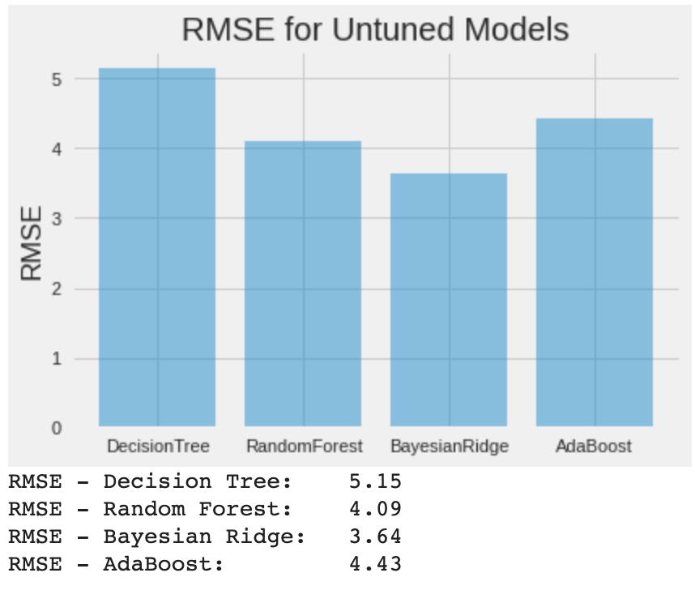
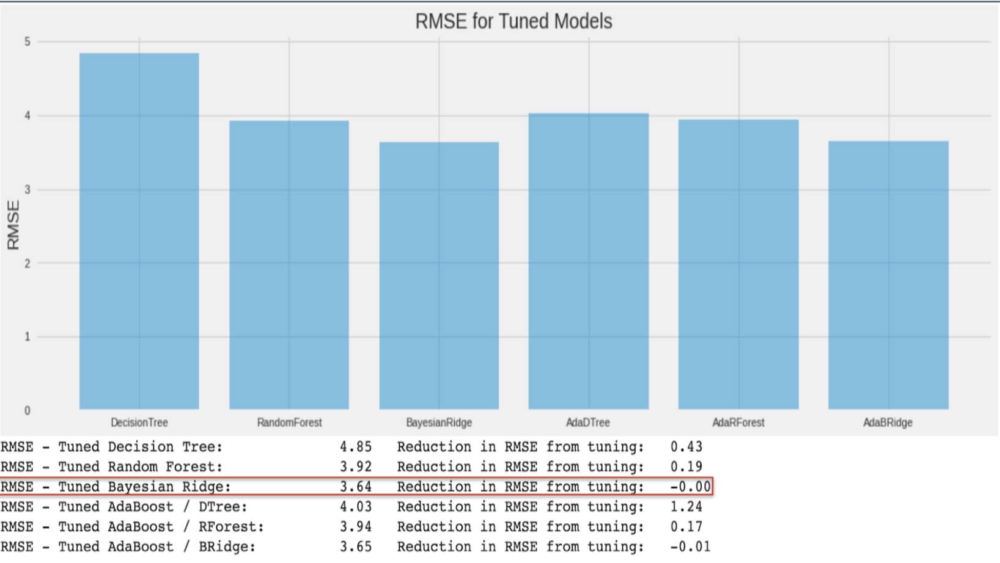
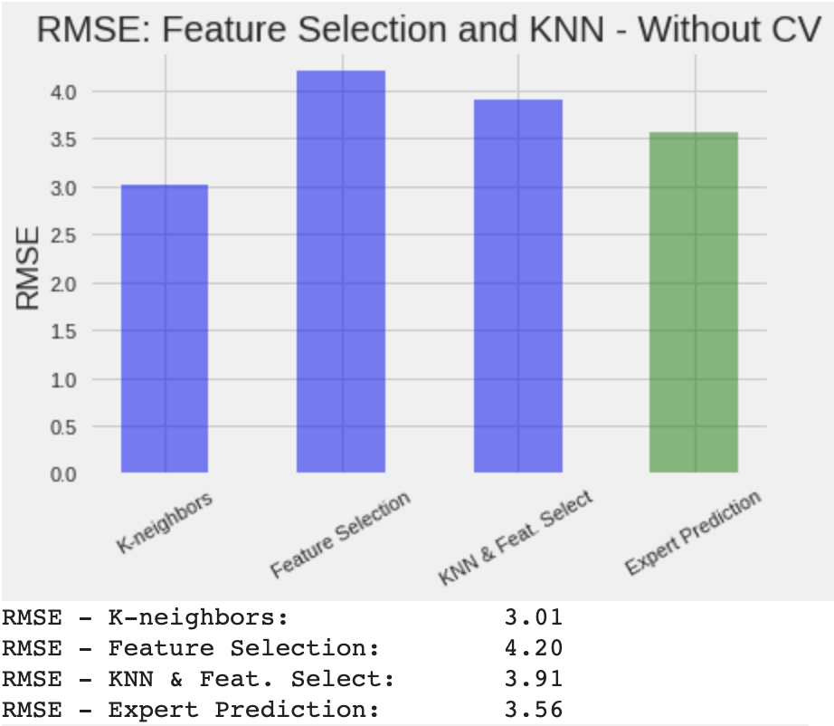
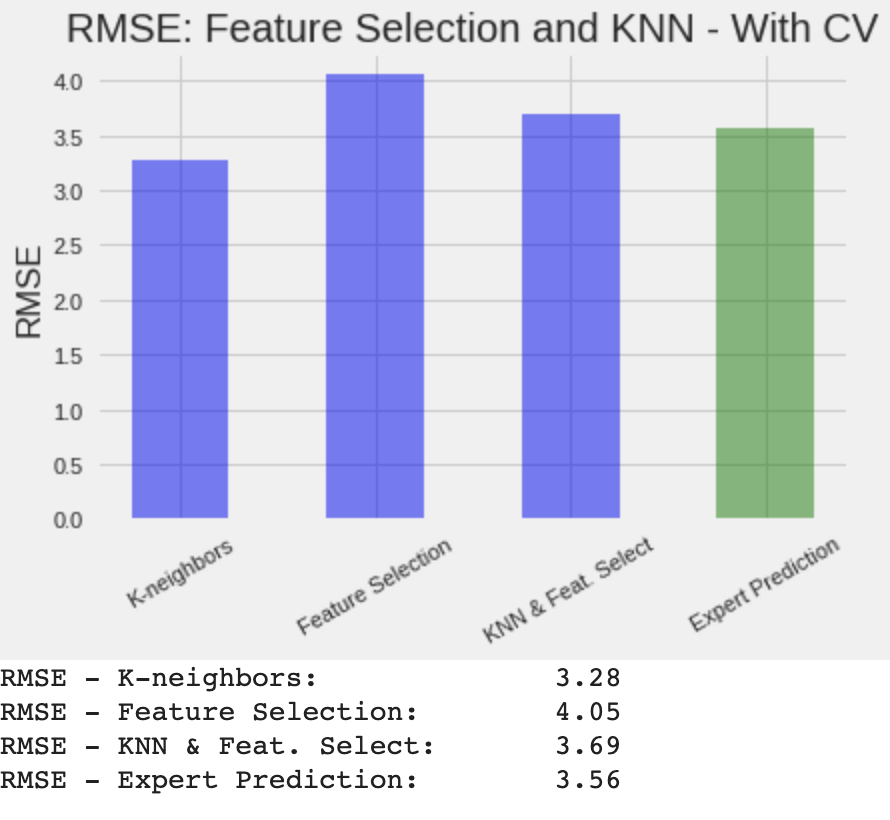

# Fantasy Football Recommendations Using Machine Learning

[GitHub README - https://github.com/CS4641-2021/sports-numbers-fans#readme](https://github.com/CS4641-2021/sports-numbers-fans#readme)
## Introduction

The goal of this project is to accurately predict average fantasy football performance for NFL wide receivers throughout a single season. Performance is calculated via points that can be earned by a player for accumulating yards gained, touchdowns scored, or passes caught. Similarly, points can be lost by a player for losing yards or fumbling the ball. At the end of every game, a player's total points are tallied, and the player with the highest number of points has the most value for that game.

Players of *fantasy* football, users, will select a roster of players every week in an attempt to accumulate the highest sum of points via their roster. Users will use a variety of information to make an informed decision on their roster selection. Typical facets of information include previous player performance, player matchups, scouting reports, and projected points. From personal experience, most players tend to lean towards projected points as the main indicator for their analysis.

## Methods

We aggregated data from fantasydata.com for the 2017-2020 season. Our data consists of approximately 35 features which reference a receivers performance in a given year. Since we are trying to predict 2020 results given 2019 data, we have three complete seasons of data to work with approximately 75 data points per season. 

We visualized and clustered our data using a couple unsupervised machine learning techniques in order to understand our data. We created a coorelational heat map to understand relationships in features. We used K-means clustering in order to identify any potential groupings in our data points. Additionally, we used parallel coordinates to visualize a normalized version of our data, which was grouped into bins according to the target variable. All of these methods together gives us an understanding of where potential sources of error can occur for a regression model.

Below, we are testing various regression models on our data. These models are being used with out-of-the-box parameters and are meant to serve as a basis for future improvement. We find that Bayesian Ridge looks to be the promising regression model from the start.

We decided to use one model going forward in order to cut back on training time and keep the project inside a manageable scope. In order to do this, we tuned the hyperparameters of these models using grid search and applied AdaBoost with each optimal regressor. After tuning every model, we end up with Ridge Regression still at the number one performer with an identical error to its untuned counterpart. Moving forward, we decided to stick with the standard Ridge Regression model

*** Talk about KNN / Feat Selection / CV Here ***

## Results

We were able to achieve a RMSE which was significantly less than the RMSE for fantasy football experts' predictions. Our best performing model used Ridge Regression on a normalized set of inputs of real and artificial values generated by the K-nearest-neighbors algorithm. We saw an error reduction of ~17% just by applying the KNN algorithm to our dataset. This algorithm was so beneficial for our model because it added rought three times as much training data to our dataset. The benefit was amplified by the fact that our dataset was already very small to begin with. 

The use of feature selection hindered our models overall performance when compared to our initial results. Reducing our feature space from fourty features to four components cut available information for the regression model by ninety percent. Despite the high explained variance for our principal components, there did not seem to be enough truly informative data available for PCA to serve as a useful tool. This suggests that we need to spend more time gathering and processing our data.

Unfortunately, we were unable to achieve any better results using cross validation throughout the entirety of this project. This suggests the presence of bias in our model, which was expected to a certain extent due the limited complete, uncoorelated data. 

## Discussion and Next Steps

## References
1Greenberg, Neil "How The Post’s fantasy football projections work". The Washington Post
https://www.washingtonpost.com/sports/2019/08/14/how-posts-fantasy-football-projections-work/

2Fantasy Data, https://fantasydata.com/nfl/fantasy-football-leaders?position=4&season=2020&seasontype=1&scope=2&subscope=1&startweek=1&endweek=1&aggregatescope=1&range=3

3Sports Data, https://sportsdata.io/developers/data-dictionary/nfl

4NFL Statistics, https://www.kaggle.com/kendallgillies/nflstatistics?select=Career_Stats_Receiving.csv
